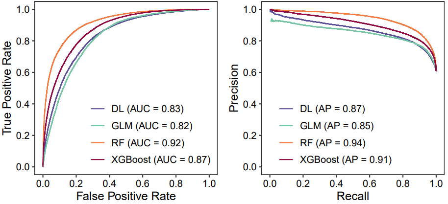
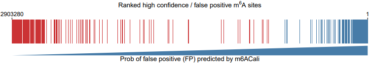
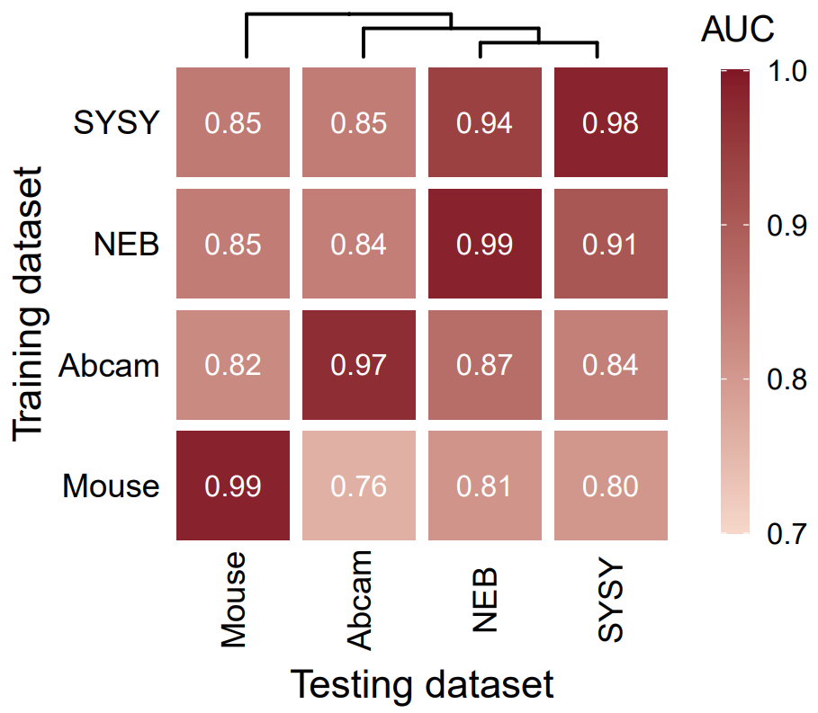
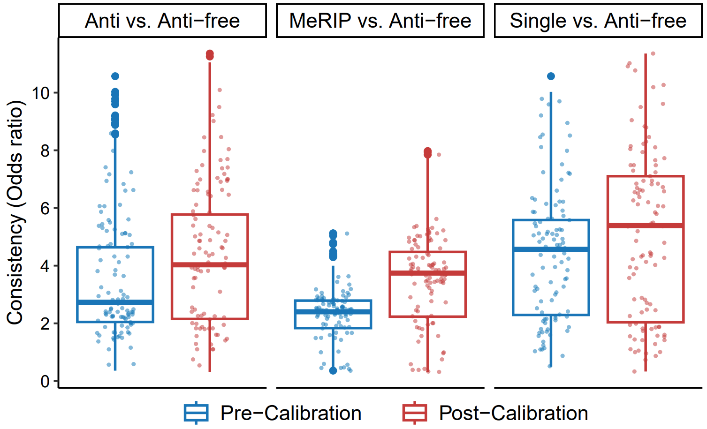

# m6ACali: Machine Learning-Powered Calibration for Accurate m6A Detection in MeRIP-Seq

<p align="center">
  
</p>

## Table of Contents 
- [Background](#Background)
- [Workflow](#Workflow)
  - [1. Establishing the Training Data for m6ACali](#1-Establishing-the-Training-Data-for-m6ACali)
  - [2. Evaluating the Efficacy of Various ML Models and Feature Sets](#2-Evaluating-the-Efficacy-of-Various-ML-Models-and-Feature-Sets)
  - [3. Influence of Exon Length and mRNA Length in False Positive m6A Identification](#3-Influence-of-Exon-Length-and-mRNA-Length-in-False-Positive-m6A-Identification)
  - [4. m6ACali: An Accurate Identifier for False Positive m6A Sites](#4-m6ACali-An-Accurate-Identifier-for-False-Positive-m6A-Sites)
  - [5. m6ACali's Broad Applicability on Independent Datasets and Novel Techniques](#5-Broad-Applicability-on-Independent-Datasets-and-Novel-Techniques)
  - [6. Enhanced Biological Insight Through Tissue m6A Profile Calibration](#6-Enhanced-Biological-Insight-Through-Tissue-m6A-Profile-Calibration)
  - [7. Improved Identification of m6A Methylation Alterations Following Methyltransferase Knockdown](#7-Improved-Identification-of-m6A-Methylation-Alterations-Following-Methyltransferase-Knockdown)
  - [8. Reconstructing False Positive m6A Landscapes via Random Capture of High-Coverage Consensus Sequences](#8-Reconstructing-False-Positive-m6A-Landscapes-via-Random-Capture-of-High-Coverage-Consensus-Sequences)
- [Dependencies and versions](#Dependencies-and-versions)
- [Direct Calibration](#Direct-Calibration)
- [Contact](#Contact) 


## Background
- **N6-methyladenosine** (m6A) is the most prevalent and functionally significant mRNA modification in eukaryotes. 
- However, discrepancies in m6A maps between studies have prompted concerns regarding the reliability of their biological validity, primarily attributed to **non-specific antibody enrichment** during immunoprecipitation (IP), which leads to **false positives**. 
- To address this challenge, we developed a novel **machine learning-based computational method** and a **gold standard benchmark dataset** using mRNA and in vitro transcribed (IVT) samples to **calibrate** transcriptome-wide m6A maps. 
- By integrating **genomic features**, we identify and eliminate non-specific antibody enrichment-induced false positives in MeRIP-seq, generating a high-accuracy m6A epitranscriptome map. 
- The model interpretation results revealed that false positives predominantly occur on **short exons and mRNAs** with **similar sequence contexts**. 
- Furthermore, our calibration function can be applied to other **antibody-dependent base resolution techniques** (e.g., miCLIP and m6ACLIP) to improve their **consistency** with antibody-independent techniques. 
- We recommend incorporating this calibration approach into **peak calling** processes to standardize putative m6A sites from various **antibody-based mapping techniques**. 
- Our method provides a systematic solution to the lack of **consistency** and **reproducibility** in m6A maps, paving the way for more precise epitranscriptomic studies.

## Workflow 
*Using SYSY dataset as example*


### 1. Establishing the Training Data for m6ACali

1.1. Download the raw sequencing data from [NCBI GEO](https://www.ncbi.nlm.nih.gov/geo/query/acc.cgi?acc=GSE151028)

- All SRR info are listed in `SRR_list.txt`.

```{bash}
fastq-dump --split-3 SRR14765584 -O ~/fastq
```

1.2. Eliminate adaptors and nucleotides of low quality using Trim Galore
```{bash}
trim_galore --stringency 3 --paired -o ~/trimmed ~/fastq/SRR14765584_1.fastq ~/fastq/SRR14765584_2.fastq
```

1.3. Match the processed reads to the reference genome UCSC hg38 using HISAT2

- UCSC hg38 genome index was downloaded from http://daehwankimlab.github.io/hisat2/download/

```{bash}
cd ~/index/hg38
wget https://genome-idx.s3.amazonaws.com/hisat/hg38_genome.tar.gz
tar -zxvf hg38_genome.tar.gz

hisat2 -x ~/index/hg38/hg38/genome -1 ~/trimmed/SRR14765584_1_val_1.fq -2 ~/trimmed/SRR14765584_2_val_2.fq -S ~/sam/SRR14765584.sam
```

1.4. Covert the sam file to bam format to save space using samtools
```{bash}
samtools view -S ~/sam/SRR14765584.sam -b > ~/bam/SRR14765584.bam
```

1.5. Perform motif-based peak calling using exomePeak2

- Motif-based peak calling: replacing sliding windows with single base sites of the **DRACH consensus motif**, while keeping the rest of the peak calling procedures the same.

> The code implementation for peak calling can be found in `./code/peak_calling.R`. The resulting peaks are stored in `./rds/peaks_IVT.rds` and `./rds/peaks_mRNA.rds`.

---
<p align="center">
  
</p>

As IVT RNA can be assured to be devoid of any modifications, it can serve as a negative control for the mRNA sample. Therefore, modification sites identified exclusively in the mRNA sample were considered **true positives**, while all sites identified in the IVT sample were deemed **false positives**.


### 2. Evaluating the Efficacy of Various ML Models and Feature Sets
2.1. Choose model

- We considered four popular machine learning models (Deep Learning, GLM, XGBoost, and Random Forest) and selected the one that best performed on the benchmark datasets.

<p align="center">
  
</p>

> The code implementation for comparing models can be found in `./code/compare_models.R`. The resulting performances are stored in `./rds/compare_models.rds`.

2.2. Choose feature set

- We compared the performance of three feature sets to select the most suitable ones for training: sequence features, genomic features, and a combination of both. 

2.2.1 Sequence-derived features

- We encoded the sequence of the the median peak size of the m6A using one-hot encoding (e.g. A – [1, 0, 0, 0], U – [0, 1, 0, 0], C – [0, 0, 1, 0], G – [0, 0, 0, 1]).

2.2.2 Genome-derived features

- We systematically procured an array of genomic characteristics from exon-only as well as intron-incorporated versions of individual genomic regions, encompassing exons, introns, genes, transcripts, 5'UTR, 3'UTR, and coding sequences.
- For each region, the collated genomic traits encompass an overlapping index, the length of the region, the proximity to the 5'/3' ends of the region, and the relative positioning of annotations within the regions, denoted as 0 for the leftmost and 1 for the rightmost position. 
 
<p align="center">
  
</p>

> The code implementation for comparing feature sets can be found in `./code/compare_feature_sets.R`. The resulting performances are stored in `./rds/compare_feature_sets.rds`.


### 3. Influence of Exon Length and mRNA Length in False Positive m6A Identification
3.1 Feature selection

- We employed reverse feature selection to streamline our data and spotlight the most salient genomic features for m6A site calibration.

<p align="center">
  
</p>

> The code implementation for feature selection can be found in `./code/feature_selection.R`. The resulting performances are stored in `./rds/feature_selection.rds`.

3.2. Feature maps of the top 2 predictors

- The top two features (exon length and mRNA length) consistently explained the most significant portion of the model performances.

<p align="center">
  
</p>

> The code implementation for visualizing top 2 features can be found in `./code/top2features.R`. The resulting performances are stored in `./rds/top2features.rds`.

### 4. m6ACali: An Accurate Identifier for False Positive m6A Sites
4.1. Build up the final models

- We selectively honed in on the top-performing genomic features that yielded the maximum AUC in our Random Forest models.

<p align="center">
  
</p>

> The code implementation for cross validation can be found in `./code/final_models.R`. The resulting performances are stored in `./rds/final_models.rds`.

4.2. Thorough analysis across DRACH motifs

- We executed an exhaustive analysis across the entire spectrum of DRACH consensus motifs.

<p align="center">
  
</p>

> The code implementation for thorough DRACH analysis can be found in `./code/color_code.R`.

4.3. Cross validation

- We conducted cross-validation on benchmark datasets to assess the generalizability of the classifiers.

<p align="center">
  
</p>

> The code implementation for cross validation can be found in `./code/cross_validation.R`. The resulting performances are stored in `./rds/cross_validation.rds`.

### 5. m6ACali's Broad Applicability: Independent Datasets and Novel Techniques

*To evaluate the utility of m6ACali with novel antibody-based datasets, we deployed the model across 24 MeRIP-Seq and 25 single-base resolution samples.*

5.1. Consistency with antibody-independent data

- In response to the likelihood of non-specific antibody binding introducing false positives in antibody-dependent data, our goal was to assess the effectiveness of our calibration model in boosting the consistency of m6A site detection when using antibody-independent data.

<p align="center">
  
</p>

> The code implementation for consistency can be found in `./code/consistency.R`. The resulting performances are stored in `./rds/consistency.rds`.

5.2. Notable improvements in the m6A profiling pipeline

- Incorporating m6ACali yielded a marked enhancement in the reliability of putative peaks.

<p align="center">
  
</p>

> The code implementation for incorporating m6ACali can be found in `./code/m6A_profiling_pipeline.R`.

### 6. Enhanced Biological Insight Through Tissue m6A Profile Calibration

6.1. Dispersion analysis 

- Predicted off-target sites exhibited markedly greater variance across samples in m6A levels than high-confidence sites.
- A significant portion of m6A sites with the highest variance were identified as likely off-targets, suggesting they predominantly constitute noise.

<p align="center">
  
</p>


6.2. GO analysis 

- Subsequent to calibration, the top 2000 m6A sites with the greatest variance demonstrated a marked enrichment in Gene Ontology (GO) categories pertinent to biological processes and functions, signifying a substantial reduction in technical noise.

<p align="center">
  
</p>


> The code implementation for tissue m6A profiles can be found in `./code/homeData.R`.


### 7. Improved Identification of m6A Methylation Alterations Following Methyltransferase Knockdown

7.1. Correlation between m6A methylation and gene expression

- Subsequent to the knockdown of m6A methyltransferases, we noted an enhanced negative correlation between gene expression and methylation at the differentially methylated peaks (DMPs) deemed high-confidence by m6ACali.
- The majority of sites exhibiting elevated m6A levels post-writer knockdown were classified as off-target by m6ACali.

<p align="center">
  
</p>

> The code implementation for negative correlation can be found in `./code/negCor.R`.

7.2. Interpret dynamic methylation changes

- Post-calibration, the differentially methylated peaks (DMPs) exhibited a greater proportion of directional consistency with biological expectations, as indicated by a negative log fold change (logFC < 0).
- When compared to two other advanced m6A site prediction tools, WHISTLE and iM6A, the DMPs processed by m6ACali consistently showed a higher alignment with predicted biological alterations.

<p align="center">
  
</p>

> The code implementation for dynamic changes can be found in `./code/pDC.R`.

### 8. Reconstructing False Positive m6A Landscapes via Random Capture of High-Coverage Consensus Sequences

**8.1. Similar sequence content amongst true positive and false positive m6A sites**

8.1.1 LR models

- We constructed a logistic regression for nucleotides surrounding the m6A site, represented by one-hot encoding, to calculate the coefficient value for individual nucleotides at specific positions.

<p align="center">
  
</p>

8.1.2 Correlation test

- We then employed correlation tests `R = 0.7472, rho = 0.7947` to authenticated the correlation between logistic regression coefficients configured on high-confidence sites and those on false-positive sites.
 
<p align="center">
  
</p>

8.1.3 Chi-squared test

- We conducted a Chi-squared test `p = 2.155e-07` to evaluate the fit between observed frequencies and expected probabilities (1/4 for the same rank, 3/4 for different ranks), assuming a random association.

|         |  same rank  |  diff rank  |
|:-------:|-----------:|-----------:|
| Observed|       17.00|        7.00|
| Expected|        0.25|        0.75|

> The code implementation for analyzing the sequence content can be found in `./code/coefficients.R`.

**8.2. Reconstruction of false positive m6A landscapes**

8.2.1 Quantifying mapped reads

- We extracted DRACH motifs and proceeded to tally the reads overlapping each of these motifs.

8.2.2 Establishing high-coverage motifs

- For a more representative scenario, we focused on DRACH motifs with high-coverage (non-methylated motifs with read count in input samples exceeding the average count of true positive m6A sites).

> The code implementation for establishing high-coverage motifs can be found in `./code/cali_befo_aft.R` ("FP read count & FP prob (gradient)" part).

8.2.3 Metagene plot

- We hypothesize that the emergence of false positives could be attributed to m6A-specific antibodies haphazardly capturing consensus sequences, the likelihood of which is further influenced by read coverage.
 
<p align="center">
  
</p>

> The code implementation for metagene plot can be found in `./code/FP_topologys.R`.


## Dependencies and versions

- Command-line tools
  - sratoolkit 2.11.3: https://ftp-trace.ncbi.nlm.nih.gov/sra/sdk/2.11.3/sratoolkit.2.11.3-ubuntu64.tar.gz
  - cutadapt 2.8: https://files.pythonhosted.org/packages/94/e2/de61c38fbe04933045287fc27bfb56eebc388b16ee8e815ef6bf9f68b4ad/cutadapt-2.8.tar.gz
  - fastqc 0.11.9: https://www.bioinformatics.babraham.ac.uk/projects/fastqc/fastqc_v0.11.9.zip
  - trim_galore 0.6.6: https://github.com/FelixKrueger/TrimGalore/archive/0.6.6.tar.gz
  - hisat2 2.1.0: ftp://ftp.ccb.jhu.edu/pub/infphilo/hisat2/downloads/hisat2-2.1.0-Linux_x86_64.zip
  - samtools 1.10: https://github.com/samtools/samtools/releases/download/1.10/samtools-1.10.tar.bz2

- R packages
  
    | Package Name                        | Version     | Package Name                        | Version     |
    |-------------------------------------|-------------|-------------------------------------|-------------|
    | exomePeak2                          | 1.9.1       | Guitar                              | 2.8.0       |
    | predictiveFeatures                  | 0.99.94     | pROC                                | 1.18.0      |
    | SummarizedExperiment                | 1.22.0      | PRROC                               | 1.3.1       |
    | phastCons100way.UCSC.hg38           | 3.7.1       | ggplot2                             | 3.4.0       |
    | BSgenome.Hsapiens.UCSC.hg38         | 1.4.3       | ggrepel                             | 0.9.1       |
    | TxDb.Hsapiens.UCSC.hg38.knownGene   | 3.13.0      | ggtree                              | 3.0.4       |
    | stringr                             | 1.4.0       | aplot                               | 0.1.4       |
    | h2o                                 | 3.34.0.3    | reshape2                            | 1.4.4       |
    | randomForest                        | 4.7.1.1     | rtracklayer                         | 1.52.1      |

## Direct Calibration
We've utilized m6ACali to predict the DRACH motifs on human hg38 exons. The results are compiled and available in `./DRACH_exon_hg38_calibration.zip`.

## Contact
Please open an issue in the GitHub repo if you have any questions/doubts/suggestions about how to use this software. Thanks!
